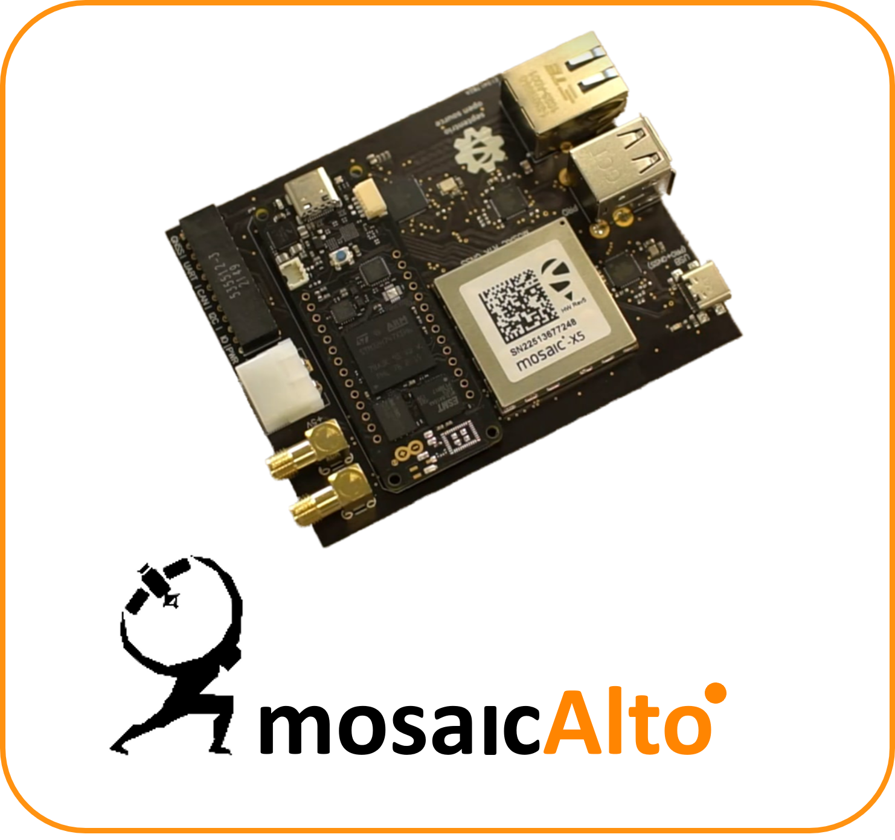

  

# MosaicAlto

## What is the MosaicAlto project?
**MosaicAlto is a Septentrio Open-Source hardware project powered by the Mosaic GNSS receiver that is compatible with the Arduino Pro Portenta boards.**
The objective of this project was to allow reliable industrial use and development with the Mosaic by having the board as a carrier for the Portenta boards.

The board also has the option to be used as a standalone device by using the USB-C connector and MosaicBus has been designed to be use either the Septentrio [**Mosaic-x5**](https://www.septentrio.com/en/products/gps/gnss-receiver-modules/mosaic-x5) or the [**Mosaic-H**](https://www.septentrio.com/en/products/gps/gnss-receiver-modules/mosaic-h).

  

mosaicAlto, is a carrier board embedding the mosaic-X5 or mosaic-H GNSS receivers, which transforms Arduino Pro “Portenta” into a single-board computer with a GPS/GNSS receiver.
While Arduino is well known by the DIY community, Arduino Pro is the professional version of this popular electronics platform, targeting industrial and other disruptive professional applications such as agriculture and construction.

mosaicAlto carrier boards makes full compatibility to Arduino Pro in an easy way allowing flexibility to use multiple Portenta boards with the same carrier board thus enabling high accuracy for industrial applications.

## What is Arduino Pro and Portenta boards?
### Arduino Pro:
Arduino Pro is the series of microcontroller boards designed for more advanced users and projects. They are typically smaller and less expensive than the standard Arduino boards, making them suitable for embedding in projects and applications where space and cost are critical factors. These boards usually use ATmega microcontrollers and have a minimalistic design with fewer built-in features compared to the standard Arduino boards.

### Arduino Portenta:
Arduino Portenta boards are the relatively newer line of boards designed for more professional and industrial IoT (Internet of Things) applications. These boards are more powerful and versatile compared to the standard Arduino boards. The Arduino Portenta series typically features microcontrollers with multicore processors and built-in connectivity options, making them suitable for various IoT and edge computing projects.

Key features of Arduino Portenta boards may include:
   * Dual-core processors (e.g., one core for high-level tasks and one for real-time tasks).
   * Secure communication features for IoT applications.
   * Enhanced connectivity options, including Wi-Fi and Bluetooth.
   * Compatibility with a wide range of industrial-grade hardware and software interfaces.
   * These boards are often used in applications that require more processing power, reliability, and security, such as industrial automation, remote monitoring, and edge computing applications.

You can buy Arduino Portenta boards here: [**Arduino Portenta**](https://store-usa.arduino.cc/collections/portenta-family) 

## What is the Mosaic module?
**[Mosaic modules](https://www.septentrio.com/en/products/gnss-receivers/rover-base-receivers/receivers-modules) are Septentrio's small-size and low-power GNSS receiver modules ideal for providing highly accurate positions.** Mosaic modules integrate the latest generation of GNSS technology, delivering highly accurate positions with minimal power consumption. While compact in size they fully retain the high-reliability and exceptional accuracy performance that Septentrio receivers are known for. True multi-frequency multi-constellation technology gives our module receivers access to every possible signal from all available GNSS satellite constellations including the U.S. GPS, European Galileo, Russian GLONASS, as well BeiDou, QZSS and NavIC. [Septentrio’s advanced field-proven algorithms](https://www.septentrio.com/en/company/septentrio-gnss-technology) exploit this signal diversity to deliver maximum positioning availability and reference network compatibility.

### Who is Septentrio?

Septentrio designs, manufactures and sells high-precision, multi-frequency, multi-constellation GPS/GNSS equipment for use in demanding applications. Septentrio products are used in a wide variety of industries including marine, construction, precision agriculture, logistics, machine control, rail, automotive, survey and mapping, geographic information systems (GIS), unmanned aerial vehicles (UAVs) and scientific. Septentrio receivers deliver consistently accurate and precise GNSS positioning scalable to centimeter-level and designed to perform solidly in the most challenging environments. Septentrio receivers are available as OEM boards, housed receivers and smart antennas.

The technology offers high accuracy and reliability thanks to GNSS+ algorithms as well as <a href="https://www.septentrio.com/en/advanced-interference-monitoring-mitigation-aim">Septentrio's Advanced Interference Monitoring and Mitigation (AIM+)</a> which protects against RF interference (jamming) and spoofing.

For more information about Septentrio products go to [**https://www.septentrio.com/**](https://web.septentrio.com/GH-SSN-home).

## How to set up MosaicAlto?
### Hardware
To start using the MosaicAlto some antennas need to be connected to the board.
When using a [**Mosaic-x5**](https://www.septentrio.com/en/products/gps/gnss-receiver-modules/mosaic-x5) only a single antenna needs to be connected to the ANT 1 SMA connector.
However when using the [**Mosaic-H**](https://www.septentrio.com/en/products/gps/gnss-receiver-modules/mosaic-h) a single or dual antenna setup can be configured.
To connect an Arduino Pro Portenta board, just click it into the designated space. Please do this in the correct orientation as printed on the MosaicAlto board.

## Interfaces on the board
### Power
To power the board there are 2 options.
Either power it through the USB-C connector.
Or by using the 5V DC power connector.

### USB-C
Through the USB-C connector it is possible to communicate to the Mosaic and/or to the Arduino board attached.

### USB-A
The 2 USB-A connectors are connected to the Arduino board to attach any peripherals.

### Ethernet
The board supports Gigabit ethernet. This connects to the Mosaic and/or Arduino board.

### Headers
The headers expose some pins of the Mosaic and Arduino.
| BOTTOM | TOP |
|:---:|:---:|
| +5V | Ground |
| GPIO 1 | ADC 0 |
| GPIO 0 | TIMER 0 |
| I2C SCL 1 | I2C SDA 1 |
| I2C SCL 0 | I2C SDA 0 |
| CAN RX 1 | CAN TX 1 |
| CAN RX 0 | CAN TX 0 |
| UART RX 1 | UART TX 1 |
| UART RX 0 | UART TX 0 |
| MOSAIC RX | MOSAIC TX |
| MOSAIC GPIO | MOSAIC EVENT B |
| MOSAIC PPS | MOSAIC EVENT A |

## How to produce
All the files needed are each in their own folder, such as the BOM (Bill Of Materials), the Gerber and Pick-place files.

***Disclamer***
All the files are provided as is. These have not been fully validaded by the author or Septentrio.
The use of any of these files are at your own risk and responsibility.

---
*Designed by A. Gheeraert*
